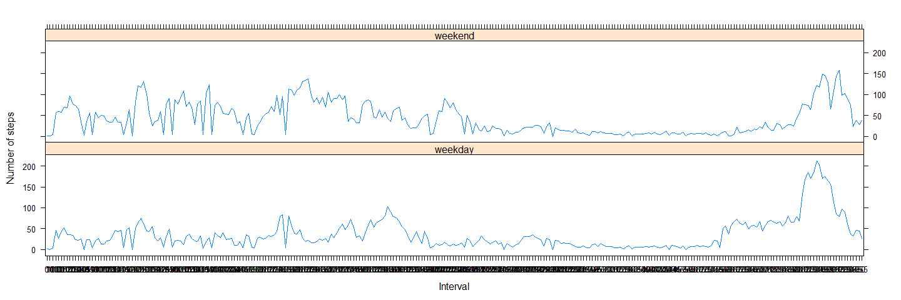

# Reproducible Research: Peer Assessment 1


## Loading and preprocessing the data

####Show any code that is needed to
####1.Load the data (i.e. read.csv())
####2.Process/transform the data (if necessary) into a format suitable for your analysis


```r
if(!file.exists('activity.csv')){
    unzip('activity.zip')
}
rawdata <- read.csv("activity.csv", colClasses = c("integer", "Date", "factor"))
activityData  <- na.omit(rawdata)
head(activityData)
```

```
##     steps       date interval
## 289     0 2012-10-02        0
## 290     0 2012-10-02        5
## 291     0 2012-10-02       10
## 292     0 2012-10-02       15
## 293     0 2012-10-02       20
## 294     0 2012-10-02       25
```

## What is mean total number of steps taken per day?

####For this part of the assignment, you can ignore the missing values in the dataset.

####1. Calculate the total number of steps taken per day


```r
stepByDay <- aggregate(activityData$steps, list(activityData$date), sum)
colnames(stepByDay) <- c("Date", "Steps")
head(stepByDay)
```

```
##         Date Steps
## 1 2012-10-02   126
## 2 2012-10-03 11352
## 3 2012-10-04 12116
## 4 2012-10-05 13294
## 5 2012-10-06 15420
## 6 2012-10-07 11015
```


####2. Make a histogram of the total number of steps taken each day


```r
with(stepByDay, {
      par(oma=c(2,0,0,0), mar=c(6.75,6.75,3,0), mgp=c(5.75,0.75,0), las=2)
      barplot(
        height=Steps,
        main="Graph of Total Steps taken per Day",
        xlab="Dates",
        ylab="Steps per Day",
        names.arg=Date,
        space=c(0)
      )
  })
```

 
  
####3. Calculate and report the mean and median of the total number of steps taken per day
* Mean

```r
stepByDayMean <- mean(stepByDay$Steps, na.rm=TRUE)
stepByDayMean
```

```
## [1] 10766.19
```

* Median

```r
stepByDayMedian <- median(stepByDay$Steps, na.rm=TRUE)
stepByDayMedian
```

```
## [1] 10765
```

## What is the average daily activity pattern?

####1. Make a time series plot (i.e. type = "l") of the 5-minute interval (x-axis) and the average number of steps taken, averaged across all days (y-axis)

Generate the mean (average) number of steps taken (ignoring NA values) for each 5-minute interval

```r
avgSteps <- aggregate(activityData$steps, list(interval = as.numeric(as.character(activityData$interval))), FUN = "mean")
colnames(avgSteps) <- c("Interval", "AvgStepsAvgAcrossDay")
head(avgSteps)
```

```
##   Interval AvgStepsAvgAcrossDay
## 1        0            1.7169811
## 2        5            0.3396226
## 3       10            0.1320755
## 4       15            0.1509434
## 5       20            0.0754717
## 6       25            2.0943396
```

A Time-Series plot is created from the above dataset


```r
  with(avgSteps, {
      plot(
        x=Interval,
        y=AvgStepsAvgAcrossDay,
        type="l",
        main="Time-Series of Average Steps against Interval",
        xlab="5-minute Interval",
        ylab="Average Steps, Average across all Days"
        
      )
  })
```

 

####2. Which 5-minute interval, on average across all the days in the dataset, contains the maximum number of steps?


```r
intervalMax <- avgSteps[avgSteps$AvgStepsAvgAcrossDay == max(avgSteps$AvgStepsAvgAcrossDay),]
intervalMax
```

```
##     Interval AvgStepsAvgAcrossDay
## 104      835             206.1698
```

## Imputing missing values

####Note that there are a number of days/intervals where there are missing values (coded as NA). The presence of missing days may introduce bias into some calculations or summaries of the data.

####1. Calculate and report the total number of missing values in the dataset (i.e. the total number of rows with NAs)


```r
countNA <- nrow(subset(rawdata, is.na(rawdata$steps)))
countNA
```

```
## [1] 2304
```

####2. Devise a strategy for filling in all of the missing values in the dataset. 

####3. Create a new dataset that is equal to the original dataset but with the missing data filled in.


```r
stepValues <- data.frame(rawdata$steps)
stepValues[is.na(stepValues),] <- ceiling(tapply(X=rawdata$steps,INDEX=rawdata$interval,FUN=mean,na.rm=TRUE))
newData <- cbind(stepValues, rawdata[,2:3])
colnames(newData) <- c("Steps", "Date", "Interval")
head(newData)
```

```
##   Steps       Date Interval
## 1     2 2012-10-01        0
## 2     1 2012-10-01        5
## 3     1 2012-10-01       10
## 4    41 2012-10-01       15
## 5    27 2012-10-01       20
## 6    43 2012-10-01       25
```

```r
sum(is.na(newData))
```

```
## [1] 0
```

####4. Make a histogram of the total number of steps taken each day and Calculate and report the mean and median total number of steps taken per day. 


```r
newDayStepSum <- aggregate(newData$Steps, list(newData$Date), sum)
colnames(newDayStepSum) <- c("Date", "Steps")
head(newDayStepSum)
```

```
##         Date Steps
## 1 2012-10-01 10909
## 2 2012-10-02   126
## 3 2012-10-03 11352
## 4 2012-10-04 12116
## 5 2012-10-05 13294
## 6 2012-10-06 15420
```


```r
  with(newDayStepSum, {
      par(oma=c(2,0,0,0), mar=c(6.75,6.75,3,0), mgp=c(5.75,0.75,0), las=2)
      barplot(
        height=Steps,
        main="Graph of Total Steps taken per Day",
        xlab="Dates",
        ylab="Steps per Day",
        names.arg=Date,
        space=c(0)
      )
  })
```

 
* Do these values differ from the estimates from the first part of the assignment? What is the impact of imputing missing data on the estimates of the total daily number of steps?

Mean total number of steps taken per day:

```r
newStepByDayMean <- mean(newDayStepSum$Steps)
newStepByDayMean
```

```
## [1] 10784.92
```
Median total number of steps taken per day:

```r
newStepByDayMedian <- median(newDayStepSum$Steps)
newStepByDayMedian
```

```
## [1] 10909
```
Compare them with the two before imputing missing data:

```r
newStepByDayMean - stepByDayMean
```

```
## [1] 18.72935
```

```r
newStepByDayMedian - stepByDayMedian
```

```
## [1] 144
```
So, after imputing the missing data, the new mean of total steps taken per day is the same as that of the old mean; the new median of total steps taken per day is greater than that of the old median.


## Are there differences in activity patterns between weekdays and weekends?

####For this part the weekdays() function may be of some help here. Use the dataset with the filled-in missing values for this part.

####1. Create a new factor variable in the dataset with two levels - "weekday" and "weekend" indicating whether a given date is a weekday or weekend day.


```r
dateDayType <- data.frame(sapply(X=newData$Date, FUN=function(day) {
  if (weekdays(as.Date(day)) %in% c("Monday", "Tuesday", "Wednesday", "Thursday", "Friday")) {
      day <- "weekday"
  }
  else {
      day <- "weekend"
  } 
}))
  
newDataWithDayType <- cbind(newData, dateDayType)
  
colnames(newDataWithDayType) <- c("Steps", "Date", "Interval", "DayType")
head(newDataWithDayType)
```

```
##   Steps       Date Interval DayType
## 1     2 2012-10-01        0 weekday
## 2     1 2012-10-01        5 weekday
## 3     1 2012-10-01       10 weekday
## 4    41 2012-10-01       15 weekday
## 5    27 2012-10-01       20 weekday
## 6    43 2012-10-01       25 weekday
```
  
####2. Make a panel plot containing a time series plot (i.e. type = "l") of the 5-minute interval (x-axis) and the average number of steps taken, averaged across all weekday days or weekend days (y-axis).


```r
dayTypeIntervalSteps <- aggregate(
      data=newDataWithDayType,
      Steps ~ DayType + Interval,
      FUN=mean
)
head(dayTypeIntervalSteps)
```

```
##   DayType Interval     Steps
## 1 weekday        0 2.2888889
## 2 weekend        0 0.2500000
## 3 weekday       10 0.2888889
## 4 weekend       10 0.1250000
## 5 weekday      100 4.2444444
## 6 weekend      100 3.6250000
```


```r
xyplot(
      type="l",
      data=dayTypeIntervalSteps,
      Steps ~ Interval | DayType,
      xlab="Interval",
      ylab="Number of steps",
      layout=c(1,2)
)
```

 
